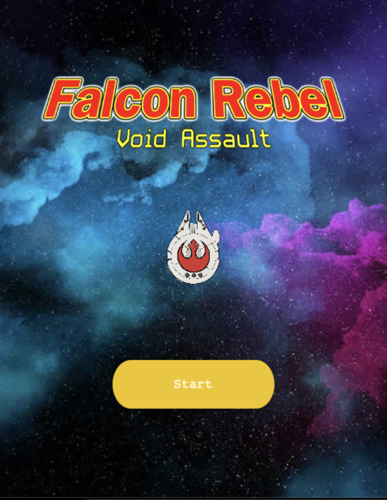

# Falcon Shooter Game JS

Falcon shooter is a game where the goal is to defeat your enemy as fast as possible. Player and foe lose health if meteors collide with their ships and of course...each others lasers! Who doesn't like lasers?!



## How to Play

- Spacebar: Shoot lasers
- Arrow keys: Move Ship

## Live Demo

[Live Demo Link]()

## Game Development

- Explain what were your initial objectives (at the end of day 2) of the project and which ones did you (or not) achieve and why

- Designing

- Development

- Deployment


## Built With

- Phaser
- JavaScript
- Webpack

## Tested With

- Jest

## Requirements

- You'll need a package manager to install the dependencies listed in package.json in order to make the game work in your local machine.

The project was built using yarn, so it's recommended to have yarn installed.

## Getting Started

- First get a local copy of the project by forking it or just clone it typing this at your terminal inside your favorite folder:

```
$ git clone git@github.com:luciano-ilha/falcon-shootergame-js.git
```

- CD into the repository
- Run `npm install`

This will install the dependencies in your local machine. This process can take a few minutes.

## Running the Game Locally

- Run `npm run build`
- Run `npm start`

## Testing

- Run `npm run test`

### Github Actions

To make sure the linters' checks using Github Actions works properly, you should follow the next steps:

1. On your recently forked repo, enable the GitHub Actions in the Actions tab.
2. Create the `feature/branch` and push.
3. Start working on your milestone as usual.
4. Open a PR from the `feature/branch` when your work is done.

## ✒️ Authors <a name = "author"></a>

👤 **Luciano Ilha Carbonel**

• Github: [@Luciano Ilha](https://github.com/luciano-ilha)
• Twitter: [@CarbonellIlha](https://twitter.com/CarbonellIlha)
• Linkedin: [@Luciano Carbonell](https://www.linkedin.com/in/luciano-carbonell/)

## 🤝 Contributing

Contributions, issues and feature requests are welcome!

Feel free to check the fork this repo and create pull request if you want to make changes.

## Show your support :muscle:

Give a ⭐️ if you like this project!

## :thumbsup: Acknowledgements

• Microverse
• ThOdinProject
